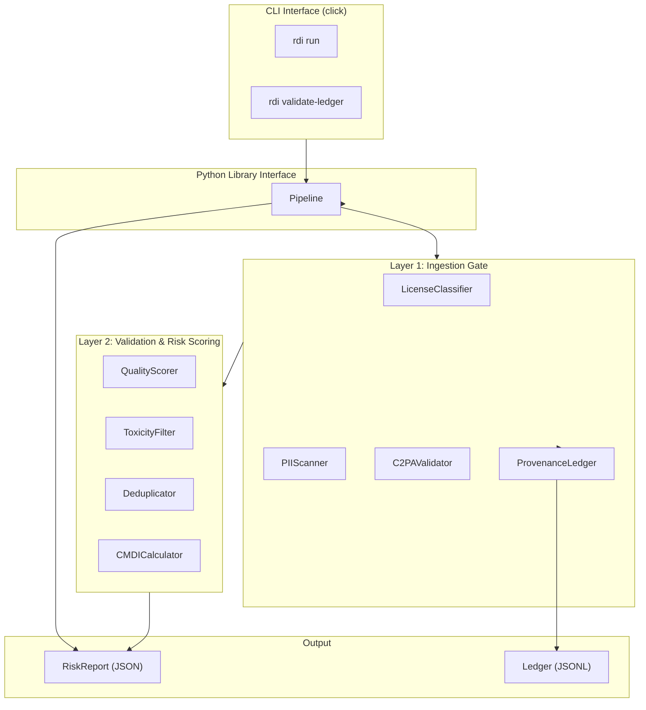

# Design Document: RDI Framework Implementation (Layers 1 & 2)

## Overview

This design describes the implementation of Layers 1 and 2 of the Responsible Data Infrastructure (RDI) Framework as a Python package (`rdi`). Layer 1 (Ingestion Gate) handles license classification, PII scanning, C2PA validation, and provenance logging. Layer 2 (Validation & Risk Scoring) handles quality scoring, toxicity filtering, deduplication, and diversity measurement (CMDI). A CLI and Python library interface expose the pipeline.

All components use open-source models, tools, and public datasets exclusively. The package targets Python 3.10+ and is structured as a single installable package with clear module boundaries.

### Key Design Decisions

1. **Single package, flat module structure**: Each component is a Python module under `rdi/`. No deep nesting — keeps imports clean and the codebase navigable for a showcase repo.
2. **Dataclass-based data models**: All inter-component data uses Python `dataclasses` with type hints for clarity and serialization.
3. **Lazy model loading**: ML models (license classifier, quality scorer, toxicity filter, NER, LDA) are loaded on first use, not at import time, to keep startup fast and memory usage predictable.
4. **Component protocol pattern**: Each component implements a consistent interface (`process` method) so the pipeline orchestrator can treat them uniformly.
5. **JSON Lines for ledger, JSON for reports**: The provenance ledger uses append-friendly JSONL; risk reports use standard JSON.

## Architecture



### Processing Flow

1. **Input**: Directory of text files or a single file path.
2. **Layer 1 — Ingestion Gate** (per record):
   - `C2PAValidator.validate()` — check content credentials (media files only)
   - `LicenseClassifier.classify()` — classify license type
   - `PIIScanner.scan()` — detect and redact PII
   - `ProvenanceLedger.append()` — log ingestion decision
3. **Layer 2 — Validation & Risk Scoring**:
   - `QualityScorer.score()` — per-record quality score
   - `ToxicityFilter.score()` — per-record toxicity scores
   - `Deduplicator.deduplicate()` — corpus-level deduplication
   - `CMDICalculator.compute()` — corpus-level diversity index
4. **Output**: `RiskReport` written as JSON to output directory; ledger persisted as JSONL.

## Components and Interfaces

### Component Base Pattern

Each component follows a consistent pattern:

```python
from dataclasses import dataclass

class ComponentName:
    """Google-style docstring."""

    def __init__(self, **config):
        """Accept configuration through constructor."""
        ...

    def process(self, input_data) -> ResultDataclass:
        """Primary processing method. Returns a dataclass result."""
        ...
```

### Layer 1 Components

#### LicenseClassifier

- **Model**: Fine-tuned `distilbert-base-uncased` on open-source license text corpus (or zero-shot `facebook/bart-large-mnli` with license category labels as a simpler baseline).
- **Input**: Raw text string.
- **Output**: `LicenseResult(category: str, confidence: float)`.
- **Categories**: `CC-BY-4.0`, `CC-BY-SA-4.0`, `CC0-1.0`, `MIT`, `Apache-2.0`, `public-domain`, `restricted`, `unknown`.
- **Behavior**: Returns `("unknown", 0.0)` for empty/malformed input. Flags for manual review when confidence < 0.7.
- **Library**: `transformers` (HuggingFace).

#### PIIScanner

- **Model**: `presidio-analyzer` with `en_core_web_lg` spaCy model for NER, plus regex recognizers for emails, phones, SSNs.
- **Input**: Raw text string.
- **Output**: `PIIScanResult(redacted_text: str, entities: list[PIIEntity])` where `PIIEntity` has `type`, `start`, `end`, `confidence`, `original_text`.
- **Redaction**: Replaces detected entities with `[EMAIL]`, `[PERSON]`, `[PHONE]`, `[ADDRESS]`, `[SSN]`.
- **Behavior**: Returns `("", [])` for empty input.
- **Library**: `presidio-analyzer`, `presidio-anonymizer`, `spacy`.

#### C2PAValidator

- **Tool**: Wraps `c2patool` CLI via `subprocess`.
- **Input**: File path.
- **Output**: `C2PAResult(has_credentials: bool, metadata: dict | None, error: str | None)`.
- **Behavior**: Raises `C2PAToolNotFoundError` if `c2patool` is not on PATH. Returns error for unsupported formats.
- **Library**: None (subprocess call to `c2patool`).

#### ProvenanceLedger

- **Storage**: JSON Lines file (one entry per line).
- **Entry**: `LedgerEntry(content_hash: str, license_result: str, pii_result: str, timestamp: str, previous_hash: str, entry_hash: str)`.
- **Chaining**: Each entry's `entry_hash` = SHA-256 of `(content_hash + license_result + pii_result + timestamp + previous_hash)`. Genesis entry uses `"0" * 64` as `previous_hash`.
- **Verification**: Recomputes chain from genesis, returns first mismatch index and description if broken.
- **Library**: `hashlib`, `json`.

### Layer 2 Components

#### QualityScorer

- **Model**: `gpt2` from HuggingFace (small, open-source, widely available).
- **Input**: Raw text string.
- **Output**: `QualityResult(perplexity: float, quality_rating: float)`.
- **Normalization**: `quality_rating = 1.0 / (1.0 + log(perplexity))` clamped to [0.0, 1.0]. Lower perplexity → higher quality.
- **Behavior**: Returns `quality_rating=0.0` for empty/whitespace input. Handles up to 10,000 tokens via sliding window.
- **Library**: `transformers`, `torch`.

#### ToxicityFilter

- **Model**: `detoxify` (Unitary's Detoxify, based on `unitary/toxic-bert`).
- **Input**: Raw text string.
- **Output**: `ToxicityResult(scores: dict[str, float], is_high_risk: bool)`.
- **Categories**: `toxic`, `severe_toxic`, `obscene`, `threat`, `insult`, `identity_hate`.
- **Flagging**: `is_high_risk = True` if any score > 0.8.
- **Behavior**: Returns all 0.0 scores for empty input.
- **Library**: `detoxify`.

#### Deduplicator

- **Algorithm**: MinHash with LSH via `datasketch`.
- **Input**: List of `(doc_id, text)` tuples.
- **Output**: `DeduplicationResult(clusters: list[list[str]], similarities: list[tuple[str, str, float]])`.
- **Config**: `threshold: float = 0.8`, `num_perm: int = 128`.
- **Library**: `datasketch`.

#### CMDICalculator

- **Sub-indices**:
  - **Linguistic diversity**: Language detection via `langdetect`, Shannon entropy of language distribution.
  - **Topical diversity**: LDA via `gensim`, Shannon entropy of topic distribution.
  - **Geographic diversity**: NER via `spacy` (`en_core_web_lg`), extract GPE entities, Shannon entropy of geo-entity distribution.
- **Composite**: Weighted sum of sub-indices, default weights `(0.333, 0.333, 0.334)`.
- **Normalization**: Each sub-index normalized to [0.0, 1.0] by dividing by `log(N)` where N is the number of distinct categories.
- **Determinism**: Fixed random seeds for LDA and language detection.
- **Input**: List of text strings.
- **Output**: `CMDIResult(composite: float, linguistic: float, topical: float, geographic: float)`.
- **Behavior**: Returns all 0.0 for empty corpus.
- **Library**: `langdetect`, `gensim`, `spacy`.

### Pipeline Orchestrator

```python
class Pipeline:
    """Orchestrates Layer 1 and Layer 2 components."""

    def __init__(self, config: PipelineConfig | None = None):
        ...

    def run(self, input_path: Path, output_path: Path) -> RiskReport:
        """Process all text files and generate a risk report."""
        ...
```

### CLI Interface

Built with `click`:

```
rdi run --input <path> --output <path> [--threshold-quality 0.3] [--threshold-toxicity 0.8]
rdi validate-ledger --ledger <path>
```

## Data Models

All data models are Python `dataclasses` with full type hints.

```python
from dataclasses import dataclass, field
from typing import Optional

@dataclass
class LicenseResult:
    category: str          # One of the 8 defined categories
    confidence: float      # 0.0 to 1.0
    flagged_for_review: bool = False

@dataclass
class PIIEntity:
    entity_type: str       # EMAIL, PERSON, PHONE, ADDRESS, SSN
    start: int
    end: int
    confidence: float
    original_text: str = ""

@dataclass
class PIIScanResult:
    redacted_text: str
    entities: list[PIIEntity] = field(default_factory=list)

@dataclass
class C2PAResult:
    has_credentials: bool
    metadata: Optional[dict] = None
    error: Optional[str] = None

@dataclass
class LedgerEntry:
    content_hash: str       # SHA-256 of content
    license_result: str     # JSON-serialized license result
    pii_result: str         # JSON-serialized PII result
    timestamp: str          # ISO 8601
    previous_hash: str      # Hash of previous entry (or "0"*64)
    entry_hash: str         # SHA-256 of this entry's fields

@dataclass
class QualityResult:
    perplexity: float
    quality_rating: float   # 0.0 to 1.0

@dataclass
class ToxicityResult:
    scores: dict[str, float]  # category -> score
    is_high_risk: bool = False

@dataclass
class DeduplicationResult:
    clusters: list[list[str]]                    # clusters of doc IDs
    similarities: list[tuple[str, str, float]]   # (doc_a, doc_b, similarity)

@dataclass
class CMDIResult:
    composite: float       # 0.0 to 1.0
    linguistic: float      # 0.0 to 1.0
    topical: float         # 0.0 to 1.0
    geographic: float      # 0.0 to 1.0

@dataclass
class RecordResult:
    record_id: str
    license: LicenseResult
    pii: PIIScanResult
    quality: QualityResult
    toxicity: ToxicityResult

@dataclass
class RiskReport:
    dataset_summary: dict
    records: list[RecordResult]
    deduplication: DeduplicationResult
    cmdi: CMDIResult
    risk_level: str        # "low", "medium", "high"
    metadata: dict = field(default_factory=dict)

@dataclass
class PipelineConfig:
    quality_threshold: float = 0.3
    toxicity_threshold: float = 0.8
    dedup_threshold: float = 0.8
    cmdi_weights: tuple[float, float, float] = (0.333, 0.333, 0.334)
    ledger_path: str = "provenance_ledger.jsonl"
    license_confidence_threshold: float = 0.7
```


## Correctness Properties

*A property is a characteristic or behavior that should hold true across all valid executions of a system — essentially, a formal statement about what the system should do. Properties serve as the bridge between human-readable specifications and machine-verifiable correctness guarantees.*

### Property 1: LicenseClassifier output invariant

*For any* text input (including empty, whitespace-only, and arbitrary strings), the `LicenseClassifier.classify()` method SHALL return a `LicenseResult` where `category` is one of `{CC-BY-4.0, CC-BY-SA-4.0, CC0-1.0, MIT, Apache-2.0, public-domain, restricted, unknown}` and `confidence` is a float in `[0.0, 1.0]`. For empty or whitespace-only inputs, the category SHALL be `"unknown"` and confidence SHALL be `0.0`.

**Validates: Requirements 1.1, 1.2, 1.5**

### Property 2: LicenseClassifier review flagging

*For any* text input, when the `LicenseClassifier` returns a confidence score below 0.7, the `flagged_for_review` field SHALL be `True`; when confidence is >= 0.7, it SHALL be `False`. Formally: `result.flagged_for_review == (result.confidence < 0.7)`.

**Validates: Requirements 1.3**

### Property 3: PIIScanner output invariant

*For any* text input containing injected PII patterns (emails, phone numbers), the `PIIScanner.scan()` method SHALL return a `PIIScanResult` where: (a) the `redacted_text` contains type-specific placeholder tokens (`[EMAIL]`, `[PHONE]`, etc.) in place of detected PII, (b) each entity in `entities` has a valid `entity_type`, `start < end`, positions within the text bounds, and `confidence` in `[0.0, 1.0]`.

**Validates: Requirements 2.2, 2.3**

### Property 4: Ledger entry structure and persistence

*For any* sequence of data records appended to the `ProvenanceLedger`, each persisted entry SHALL contain: a SHA-256 `content_hash`, `license_result`, `pii_result`, an ISO 8601 `timestamp`, `previous_hash`, and `entry_hash`. The JSONL file SHALL contain one valid JSON object per line, and the number of lines SHALL equal the number of appended entries.

**Validates: Requirements 3.1, 3.5**

### Property 5: Ledger chain integrity

*For any* sequence of N entries appended to the `ProvenanceLedger`, for each entry at index `i > 0`, `entry[i].previous_hash` SHALL equal `entry[i-1].entry_hash`. The genesis entry (index 0) SHALL have `previous_hash == "0" * 64`.

**Validates: Requirements 3.2**

### Property 6: Ledger verification correctness

*For any* `ProvenanceLedger` with N entries: (a) if no entries have been tampered with, `verify()` SHALL return success; (b) if entry at index `i` is tampered with (any field modified), `verify()` SHALL return failure and report index `i` as the first corrupted entry.

**Validates: Requirements 3.3, 3.4**

### Property 7: Ledger round-trip

*For any* valid `LedgerEntry`, writing it to the JSONL ledger file and then reading the ledger back SHALL produce a ledger containing that entry with identical field values.

**Validates: Requirements 3.6**

### Property 8: QualityScorer output invariant

*For any* text input, the `QualityScorer.score()` method SHALL return a `QualityResult` where `perplexity` is a non-negative float and `quality_rating` is in `[0.0, 1.0]`. For empty or whitespace-only inputs, `quality_rating` SHALL be `0.0`.

**Validates: Requirements 5.1, 5.2, 5.4**

### Property 9: ToxicityFilter output invariant

*For any* text input, the `ToxicityFilter.score()` method SHALL return a `ToxicityResult` containing scores for all six categories (`toxic`, `severe_toxic`, `obscene`, `threat`, `insult`, `identity_hate`), each a float in `[0.0, 1.0]`.

**Validates: Requirements 6.1, 6.2**

### Property 10: ToxicityFilter high-risk flagging

*For any* text input, the `ToxicityFilter` SHALL set `is_high_risk = True` if and only if at least one category score exceeds 0.8. Formally: `result.is_high_risk == any(s > 0.8 for s in result.scores.values())`.

**Validates: Requirements 6.3**

### Property 11: Deduplicator output structure

*For any* corpus of text documents, the `Deduplicator.deduplicate()` method SHALL return a `DeduplicationResult` containing `clusters` (list of lists of doc IDs) and `similarities` (list of tuples with doc pairs and Jaccard similarity scores in `[0.0, 1.0]`). Every input doc ID SHALL appear in exactly one cluster.

**Validates: Requirements 7.1, 7.3**

### Property 12: Deduplicator identical document clustering

*For any* text string, when two documents with identical content are submitted to the `Deduplicator`, they SHALL be placed in the same duplicate cluster.

**Validates: Requirements 7.5**

### Property 13: CMDI output range invariant

*For any* non-empty text corpus, the `CMDICalculator.compute()` method SHALL return a `CMDIResult` where `composite`, `linguistic`, `topical`, and `geographic` are all floats in `[0.0, 1.0]`.

**Validates: Requirements 8.1, 8.2, 8.4, 8.5, 8.6**

### Property 14: CMDI composite is weighted sum

*For any* non-empty text corpus and any valid weight triple `(w1, w2, w3)` where `w1 + w2 + w3 ≈ 1.0`, the composite CMDI score SHALL equal `w1 * linguistic + w2 * topical + w3 * geographic` (within floating-point tolerance).

**Validates: Requirements 8.3**

### Property 15: CMDI determinism

*For any* text corpus, computing the CMDI score twice on the same corpus SHALL produce identical `composite`, `linguistic`, `topical`, and `geographic` values.

**Validates: Requirements 8.9**

### Property 16: RiskReport structure invariant

*For any* processed dataset, the generated `RiskReport` SHALL: (a) be serializable as valid JSON, (b) contain all required sections (dataset summary, per-record results, deduplication, CMDI), and (c) have `risk_level` in `{"low", "medium", "high"}`.

**Validates: Requirements 9.2, 9.3, 9.4**

### Property 17: RiskReport round-trip

*For any* valid `RiskReport` object, serializing to JSON and deserializing back SHALL produce an equivalent `RiskReport` with identical field values.

**Validates: Requirements 9.5**

## Error Handling

### Component-Level Error Handling

| Component | Error Condition | Behavior |
|-----------|----------------|----------|
| LicenseClassifier | Empty/malformed input | Return `("unknown", 0.0)` |
| LicenseClassifier | Model loading failure | Raise `ModelLoadError` with model name and path |
| PIIScanner | Empty input | Return `("", [])` |
| PIIScanner | spaCy model not found | Raise `ModelLoadError` with installation instructions |
| C2PAValidator | c2patool not installed | Raise `C2PAToolNotFoundError` with install instructions |
| C2PAValidator | Unsupported file format | Return `C2PAResult(error="Unsupported format. Supported: ...")` |
| QualityScorer | Empty/whitespace input | Return `QualityResult(perplexity=0.0, quality_rating=0.0)` |
| QualityScorer | Text exceeds token limit | Use sliding window, no error |
| ToxicityFilter | Empty input | Return all scores as 0.0 |
| Deduplicator | Empty corpus | Return empty clusters and similarities |
| CMDICalculator | Empty corpus | Return all scores as 0.0 |
| ProvenanceLedger | Corrupted chain | Return `(index, description)` of first mismatch |
| ProvenanceLedger | File I/O error | Raise `LedgerIOError` with file path and OS error |

### CLI Error Handling

| Condition | Behavior |
|-----------|----------|
| Input path does not exist | Exit code 1, message: `"Error: Input path '{path}' does not exist."` |
| No processable files found | Exit code 1, message: `"Error: No text files found in '{path}'."` |
| Output directory not writable | Exit code 1, message: `"Error: Cannot write to output directory '{path}'."` |
| Component model fails to load | Exit code 2, message with component name and remediation steps |

### Exception Hierarchy

```python
class RDIError(Exception):
    """Base exception for all RDI pipeline errors."""

class ModelLoadError(RDIError):
    """Raised when an ML model fails to load."""

class C2PAToolNotFoundError(RDIError):
    """Raised when c2patool CLI is not available."""

class LedgerIOError(RDIError):
    """Raised on ledger file I/O failures."""

class LedgerIntegrityError(RDIError):
    """Raised when ledger chain verification fails."""

class ValidationError(RDIError):
    """Raised on invalid input to pipeline components."""
```

## Testing Strategy

### Dual Testing Approach

The testing strategy uses two complementary approaches:

1. **Property-based tests** (via `hypothesis`): Verify the 17 correctness properties defined above. Each property test runs a minimum of 100 iterations with randomly generated inputs. These tests validate universal invariants across the input space.

2. **Example-based unit tests** (via `pytest`): Cover specific scenarios, integration points, edge cases, and error conditions that are not well-suited to property-based testing.

### Property-Based Testing Configuration

- **Library**: `hypothesis` (Python's standard PBT library)
- **Minimum iterations**: 100 per property (`@settings(max_examples=100)`)
- **Tag format**: Each test is tagged with a comment: `# Feature: rdi-framework-implementation, Property {N}: {title}`
- **Generators**: Custom `hypothesis` strategies for `LicenseResult`, `PIIScanResult`, `LedgerEntry`, `QualityResult`, `ToxicityResult`, `RiskReport`, and text corpora.

### Property Test Mapping

| Property | Test Target | Generator Strategy |
|----------|-------------|-------------------|
| P1: LicenseClassifier output invariant | `LicenseClassifier.classify()` | `st.text()` including empty strings |
| P2: LicenseClassifier review flagging | `LicenseClassifier.classify()` | `st.text()` |
| P3: PIIScanner output invariant | `PIIScanner.scan()` | Text with injected email/phone patterns |
| P4: Ledger entry structure | `ProvenanceLedger.append()` | Random data records |
| P5: Ledger chain integrity | `ProvenanceLedger` | Random sequences of records |
| P6: Ledger verification | `ProvenanceLedger.verify()` | Random ledgers + random tampering |
| P7: Ledger round-trip | `ProvenanceLedger` write/read | Random `LedgerEntry` objects |
| P8: QualityScorer output invariant | `QualityScorer.score()` | `st.text()` including whitespace |
| P9: ToxicityFilter output invariant | `ToxicityFilter.score()` | `st.text()` |
| P10: ToxicityFilter flagging | `ToxicityFilter.score()` | `st.text()` |
| P11: Deduplicator output structure | `Deduplicator.deduplicate()` | Random text corpora |
| P12: Deduplicator identical clustering | `Deduplicator.deduplicate()` | Random text duplicated |
| P13: CMDI output range | `CMDICalculator.compute()` | Random text corpora |
| P14: CMDI weighted sum | `CMDICalculator.compute()` | Random corpora + random weights |
| P15: CMDI determinism | `CMDICalculator.compute()` | Random text corpora |
| P16: RiskReport structure | `RiskReport` serialization | Random `RiskReport` objects |
| P17: RiskReport round-trip | `RiskReport` serialize/deserialize | Random `RiskReport` objects |

### Example-Based Unit Tests

| Area | Tests |
|------|-------|
| License classification | Known license texts produce correct categories (2.1); F1 benchmark on test set (1.4) |
| PII scanning | Each PII type detected with known examples (2.1); precision benchmark (2.4); empty input (2.5) |
| C2PA validation | File with credentials (4.1); file without credentials (4.2); missing c2patool (4.3); unsupported format (4.4) |
| Quality scoring | Well-formed vs random text ordering (5.5); 10K token document (5.3) |
| Toxicity filtering | Empty input returns zeros (6.5); known toxic text scores high |
| Deduplication | Unrelated documents in separate clusters (7.6); performance benchmark (7.4) |
| CMDI | Homogeneous corpus scores < 0.15 (8.7); empty corpus returns zeros (8.8) |
| CLI | `rdi run` with valid input (10.1-10.3); `rdi validate-ledger` (10.4); invalid path error (10.6) |
| Library API | Import all components (11.1); constructor config (11.2); Pipeline orchestration (11.3) |

### Test Organization

```
tests/
├── conftest.py              # Shared fixtures and hypothesis strategies
├── test_license_classifier.py
├── test_pii_scanner.py
├── test_provenance_ledger.py
├── test_c2pa_validator.py
├── test_quality_scorer.py
├── test_toxicity_filter.py
├── test_deduplicator.py
├── test_cmdi_calculator.py
├── test_risk_report.py
├── test_pipeline.py
└── test_cli.py
```

### Dependencies

| Package | Purpose | Version |
|---------|---------|---------|
| `transformers` | License classifier, quality scorer (GPT-2) | >=4.30 |
| `torch` | Model inference backend | >=2.0 |
| `presidio-analyzer` | PII detection | >=2.2 |
| `presidio-anonymizer` | PII redaction | >=2.2 |
| `spacy` | NER for PII and CMDI geographic diversity | >=3.5 |
| `detoxify` | Toxicity classification | >=0.5 |
| `datasketch` | MinHash/LSH deduplication | >=1.6 |
| `gensim` | LDA topic modeling for CMDI | >=4.3 |
| `langdetect` | Language detection for CMDI | >=1.0 |
| `click` | CLI framework | >=8.0 |
| `tqdm` | Progress indicator | >=4.60 |
| `hypothesis` | Property-based testing | >=6.80 |
| `pytest` | Test framework | >=7.0 |
