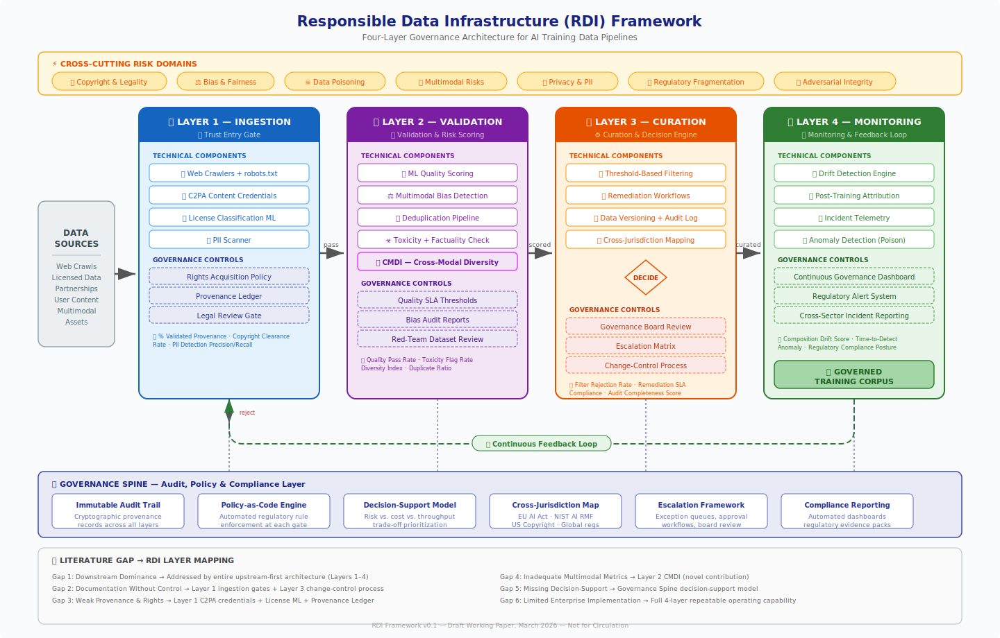

# RDI Framework Overview

> Full description of the four-layer Responsible Data Infrastructure architecture for AI training data governance.

## Introduction

The Responsible Data Infrastructure (RDI) Framework is a design-science governance architecture that embeds controls into AI training data pipelines at the point of ingestion, rather than relying solely on post-training interventions. It treats training data pipelines as enterprise risk and decision-support systems, organizing governance across four sequential layers with a cross-cutting risk overlay and a governance spine.

This document details each layer's technical components, governance controls, metrics, and their relationships.

## Architecture Overview

The framework flows left to right through four layers:

```
DATA SOURCES → [Layer 1: Ingestion] → [Layer 2: Validation] → [Layer 3: Curation] → [Layer 4: Monitoring] → GOVERNED CORPUS
                                                                                              ↑
                                                                                    Continuous Feedback Loop ──────────────────┘
```

Each layer connects downward to the Governance Spine, which provides cross-cutting audit, policy, and compliance capabilities. A feedback loop from Layer 4 back to Layer 1 enables iterative, self-correcting governance.



## Cross-Cutting Risk Domains

Seven risk domains span all four layers. Every component in the pipeline must account for these risks:

| Risk Domain | Description |
|-------------|-------------|
| Copyright & Legality | Licensing compliance, fair use, rights acquisition for training data |
| Bias & Fairness | Representational imbalance across demographic, geographic, and linguistic dimensions |
| Data Poisoning | Adversarial manipulation of training data to degrade model behavior |
| Multimodal Risks | Governance gaps specific to image, audio, video, and cross-modal corpora |
| Privacy & PII | Personally identifiable information leaking into training data |
| Regulatory Fragmentation | Divergent requirements across jurisdictions (EU AI Act, NIST AI RMF, US Copyright) |
| Adversarial Integrity | Robustness against intentional corruption of the data pipeline itself |


## Layer 1: Ingestion — Trust Entry Gate

The gatekeeping layer where data first enters the pipeline. No data reaches training infrastructure without passing through Layer 1's validation checks.

### Technical Components

| Component | Function |
|-----------|----------|
| Web Crawlers + robots.txt | Respect site-level opt-out signals during data collection |
| C2PA Content Credentials | Validate provenance claims on media files using the Coalition for Content Provenance and Authenticity standard |
| License Classification ML | ML-based classifier that categorizes incoming data by license type (CC-BY, MIT, Apache, public domain, restricted, unknown) with confidence scoring |
| PII Scanner | Detects and redacts personally identifiable information (names, emails, phone numbers, addresses, SSNs) before data enters the pipeline |

### Governance Controls

| Control | Purpose |
|---------|---------|
| Rights Acquisition Policy | Defines acceptable license types and acquisition terms for training data |
| Provenance Ledger | Tamper-evident, SHA-256 hash-chained append-only log recording every ingestion decision with cryptographic integrity verification |
| Legal Review Gate | Escalation path for data with ambiguous licensing or provenance that requires human review |

### Key Metrics

- Percentage of data with validated provenance
- Copyright clearance rate
- PII detection precision and recall

### POC Implementation Status

The POC implements the PII Scanner (using Microsoft Presidio + spaCy `en_core_web_lg`) and the Provenance Ledger (SHA-256 hash-chained JSONL). The License Classifier and C2PA Validator are stubbed for Phase 2.

---

## Layer 2: Validation & Risk Scoring

Scores incoming data across quality, safety, and representational dimensions. This layer introduces the Cross-Modal Diversity Index (CMDI), a novel composite metric for measuring representational fairness.

### Technical Components

| Component | Function |
|-----------|----------|
| ML Quality Scoring | Measures text coherence and factuality using perplexity-based scoring (GPT-2 or equivalent) |
| Multimodal Bias Detection | Identifies representational imbalances across demographic, geographic, and linguistic dimensions |
| Deduplication Pipeline | Detects near-duplicate documents using MinHash with Locality-Sensitive Hashing (LSH) to prevent training bias from overrepresented content |
| Toxicity + Factuality Check | Multi-category toxicity scoring (toxic, severe toxic, obscene, threat, insult, identity hate) using open-source classifiers |
| CMDI — Cross-Modal Diversity Index | Novel composite metric combining linguistic diversity (language distribution entropy), topical diversity (LDA topic entropy), and geographic diversity (NER geo-entity entropy) into a single score |

### Governance Controls

| Control | Purpose |
|---------|---------|
| Quality SLA Thresholds | Configurable minimum quality scores that data must meet to proceed |
| Bias Audit Reports | Structured reports documenting representational balance across protected dimensions |
| Red-Team Dataset Review | Adversarial review process for identifying edge cases and failure modes in the validation pipeline |

### Key Metrics

- Quality pass rate
- Toxicity flag rate
- Cross-Modal Diversity Index (composite and sub-indices)
- Duplicate ratio

### POC Implementation Status

The POC implements the Toxicity Filter (using Detoxify / `unitary/toxic-bert`) and the Deduplicator (using datasketch MinHash/LSH). The Quality Scorer and CMDI Calculator are stubbed for Phase 2.

---

## Layer 3: Curation & Decision Engine

The decision layer where governance controls determine what enters training and under what conditions. Combines automated threshold-based filtering with human-in-the-loop escalation for edge cases.

### Technical Components

| Component | Function |
|-----------|----------|
| Threshold-Based Filtering | Automated accept/reject/escalate decisions based on configurable score thresholds from Layer 2 |
| Remediation Workflows | Automated pipelines for fixing recoverable issues (e.g., re-redacting PII, re-scoring after deduplication) |
| Data Versioning + Audit Log | Immutable versioning of curated datasets with full audit trail linking back to ingestion decisions |
| Cross-Jurisdiction Mapping | Maps data governance requirements across regulatory frameworks (EU AI Act, NIST AI RMF, US Copyright Office guidance) |

### Governance Controls

| Control | Purpose |
|---------|---------|
| Governance Board Review | Human review for high-stakes or ambiguous curation decisions |
| Escalation Matrix | Defines which score combinations trigger automatic escalation vs. automatic approval |
| Change-Control Process | Formal process for modifying curation thresholds, requiring documented justification and approval |

### Key Metrics

- Filter rejection rate
- Remediation SLA compliance
- Audit completeness score

### Implementation Status

Layer 3 is not yet implemented in the POC. It is planned for a future phase.

---

## Layer 4: Monitoring & Feedback Loop

Continuous post-curation monitoring with a feedback loop back to Layer 1. This layer is critical for the design-science framing of governance as an iterative, self-correcting system.

### Technical Components

| Component | Function |
|-----------|----------|
| Drift Detection Engine | Monitors dataset composition over time, detecting shifts in language distribution, topic balance, or quality scores |
| Post-Training Attribution | Traces model behaviors back to specific training data segments for accountability |
| Incident Telemetry | Collects and correlates governance incidents (rejected data, escalations, threshold breaches) for trend analysis |
| Anomaly Detection (Poison) | Identifies potential data poisoning attempts through statistical anomaly detection on ingestion patterns |

### Governance Controls

| Control | Purpose |
|---------|---------|
| Continuous Governance Dashboard | Real-time visibility into pipeline health, risk posture, and compliance status |
| Regulatory Alert System | Monitors regulatory changes and flags datasets or processes that may be affected |
| Cross-Sector Incident Reporting | Standardized incident reporting for sharing governance learnings across teams and organizations |

### Key Metrics

- Composition drift score
- Time-to-detect anomaly
- Regulatory compliance posture

### Implementation Status

Layer 4 is not yet implemented in the POC. It is planned for a future phase.

---


## Governance Spine

The Governance Spine is a cross-cutting layer that connects to all four pipeline layers, providing audit, policy, and compliance infrastructure.

| Spine Component | Function |
|-----------------|----------|
| Immutable Audit Trail | Cryptographic provenance records across all layers, ensuring every decision is traceable and tamper-evident |
| Policy-as-Code Engine | Automated regulatory rule enforcement at each gate, translating legal requirements into executable checks |
| Decision-Support Model | Risk vs. cost vs. throughput trade-off prioritization, helping governance teams make informed decisions about data inclusion |
| Cross-Jurisdiction Map | Mapping of requirements across EU AI Act, NIST AI RMF, US Copyright, and other global regulations |
| Escalation Framework | Exception queues, approval workflows, and governance board review processes for edge cases |
| Compliance Reporting | Automated dashboards and regulatory evidence packs for demonstrating compliance to auditors and regulators |

---

## Literature Gap Mapping

The RDI Framework is motivated by six critical gaps identified in the AI governance literature. Each gap maps to specific framework components:

| # | Gap | RDI Response | Primary Layer(s) |
|---|-----|-------------|-------------------|
| 1 | Downstream dominance over upstream governance | Entire upstream-first architecture | Layers 1–4 |
| 2 | Documentation without continuous operational control | Ingestion gates + change-control processes | Layer 1 + Layer 3 |
| 3 | Weak operationalization of provenance and rights | C2PA credentials + License ML + Provenance Ledger | Layer 1 |
| 4 | Inadequate multimodal governance metrics | Cross-Modal Diversity Index (CMDI) — novel contribution | Layer 2 |
| 5 | Missing decision-support for governance trade-offs | Governance Spine decision-support model | Governance Spine |
| 6 | Limited enterprise implementation research | Full four-layer repeatable operating capability | All layers |

---

## Data Flow Summary

1. **Data Sources** (web crawls, licensed data, partnerships, user content, multimodal assets) enter the pipeline at Layer 1.
2. **Layer 1 (Ingestion)** validates provenance, classifies licenses, scans for PII, and logs decisions to the provenance ledger. Data that fails validation is rejected.
3. **Layer 2 (Validation)** scores passing data for quality, toxicity, duplication, and diversity. Each record receives a multi-dimensional risk profile.
4. **Layer 3 (Curation)** applies threshold-based filtering and human-in-the-loop review to decide what enters the training corpus. Remediation workflows handle recoverable issues.
5. **Layer 4 (Monitoring)** continuously monitors the curated corpus for drift, anomalies, and regulatory changes, feeding insights back to Layer 1 via the feedback loop.
6. The **Governance Spine** provides audit trails, policy enforcement, and compliance reporting across all layers.

The output is a governed training corpus with full provenance traceability, documented risk assessments, and regulatory compliance evidence.

---

## POC Scope

The current proof-of-concept implements Layers 1 and 2 with the following components:

| Layer | Implemented | Stubbed (Phase 2) |
|-------|------------|-------------------|
| Layer 1 | PII Scanner, Provenance Ledger | License Classifier, C2PA Validator |
| Layer 2 | Toxicity Filter, Deduplicator | Quality Scorer, CMDI Calculator |
| Integration | Pipeline Orchestrator, CLI, Risk Report | — |

All components use exclusively open-source models, tools, and public datasets. See the [Quick Start guide](../README.md#quick-start) for installation and usage instructions.
